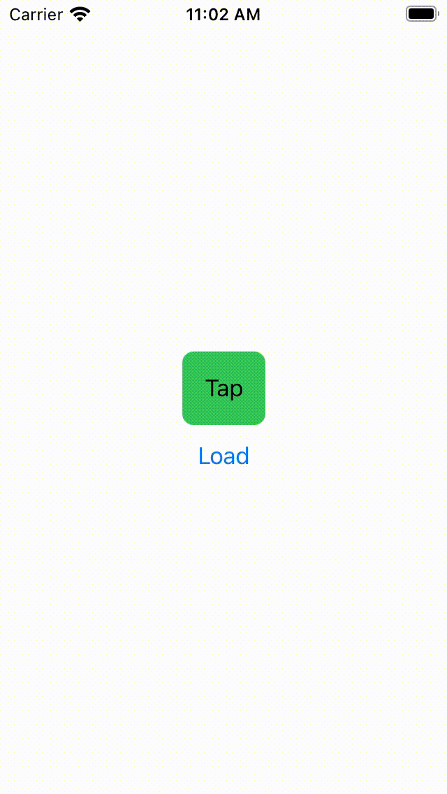

# AsyncSample

swift async/await sample

## Requirements

- Xcode 13.0 beta1

## syncとasync

### 同期的に処理をするとレスポンスが返ってくるまで画面が固まる


### 非同期で処理すると画面が固まるのを防ぐことができる



## async/awaitを使わない場合

```swift

func getUserInfo() {
    getUserId { [weak self] id in
        self?.getUserName(id: id) { [weak self] name in
            self?.getUserAge(id: id) { [weak self] age in
                self?.getUserIsPremium(id: id) { isPremium in
                    DispatchQueue.main.async { [weak self] in
                        self?.user = User(id: id,
                                            name: name,
                                            age: age,
                                            isPremium: isPremium)
                        self?.isLoading = false
                    }
                }
            }
        }
    }
}

```

## async/awaitに変換した場合

```swift

func getUserInfo() {
    isLoading = true
    user = nil
    async { @MainActor in
        let id = await getUserId()
        let name = await getUserName(id: id)
        let age = await getUserAge(id: id)
        let isPremium = await getUserIsPremium(id: id)
        user = User(id: id, name: name, age: age, isPremium: isPremium)
        isLoading = false
    }
}
```

## async/awaitを使わない場合(同時並行処理)

```swift

func getUserInfo() {
    let group = DispatchGroup()
    getUserId { [weak self] id in
        var name = ""
        var age = 0
        var isPremium = false

        self?.getUserName(id: id, group: group) { name = $0 }
        self?.getUserAge(id: id, group: group) { age = $0 }
        self?.getUserIsPremium(id: id, group: group) { isPremium = $0 }
        group.notify(queue: .main) { [weak self] in
            self?.user = User(id: id,
                                name: name,
                                age: age,
                                isPremium: isPremium)
            self?.isLoading = false
        }
    }
}
```

## async/awaitに変換した場合(同時並行処理)

```swift

func getUserInfo() {
    async { @MainActor in
        let id = await self.getUserId()
        async let name = getUserName(id: id)
        async let age = getUserAge(id: id)
        async let isPremium = getUserIsPremium(id: id)
        user = await User(id: id, name: name, age: age, isPremium: isPremium)
        isLoading = false
    }
}
```

## 既存の非同期処理をasyncに変換する方法

[UnsafeContinuation](https://github.com/apple/swift-evolution/blob/d8c5540679b35c32f70491190c20a0cafc1d7605/proposals/0300-continuation.md)を利用する

## URLSessionを使った例

```swift

func request(_ url: URL) async throws -> Data {
    struct NetworkError: Error {}

    return try await withUnsafeThrowingContinuation { (continuation) in
        URLSession.shared.dataTask(with: url) { (data, response, error) in
            switch (data, error) {
            case let (_, error?):
                return continuation.resume(throwing: error)
            case let (data?, _):
                return continuation.resume(returning: data)
            case (nil, nil):
                return continuation.resume(throwing: NetworkError())
            }
        }
        .resume()
    }
}
```

## 他言語のasync/await

### Javascript

ES2017から利用可能

Promiseを返して結果をawaitすることができる

<https://developer.mozilla.org/ja/docs/Web/JavaScript/Reference/Statements/async_function>

```Javascript

function getProcessedData(url) {
  return downloadData(url) // returns a promise
    .catch(e => {
      return downloadFallbackData(url)  // returns a promise
    })
    .then(v => {
      return processDataInWorker(v)  // returns a promise
    })
}

async function getProcessedData(url) {
  let v
  try {
    v = await downloadData(url)
  } catch(e) {
    v = await downloadFallbackData(url)
  }
  return processDataInWorker(v)
}
```

awaitをつけないで初期化すると即時に処理を開始することができて
後で結果をawaitすることができる
(SwiftではStructured Concurrencyという仕組みで似たようなことができる)

```Javascript

async function sequentialStart() {
  console.log('==SEQUENTIAL START==')

  // 1. ここは即時実行される
  const slow = await resolveAfter2Seconds()
  console.log(slow) // 2. ここは 1. の2秒後に実行される

  const fast = await resolveAfter1Second()
  console.log(fast) // 3. ここは 1. の3秒後に実行される
}

async function concurrentStart() {
  console.log('==CONCURRENT START with await==');
  const slow = resolveAfter2Seconds() // 即時実行
  const fast = resolveAfter1Second() // 即時実行

  // 1. ここは即時実行される
  console.log(await slow) // 2. ここは 1. の2秒後に実行される
  console.log(await fast) // 3. ここは 1. の2秒後（2.の直後）に実行される
}
```

### C\#

C#5から利用可能

Taskを返してawaitで結果をawaitすることができる

<https://docs.microsoft.com/ja-jp/dotnet/csharp/programming-guide/concepts/async/>

```C#

void run()
{
    Task<string> task = Task.Run(() => {
        return HeavyMethod();
    });
    // 結果が返ってくるまでメインスレッドをブロックする
    string result = task.Result;
    Console.WriteLine(result);
}

string HeavyMethod()
{
    Console.WriteLine("重い処理"); 
    Thread.Sleep(5000);
    return "heavy"
}
```

```C#

async Task run()
{
    string result = await HeavyMethod();
    Console.WriteLine(result);
}

private async Task<string> string HeavyMethod()
{
    Console.WriteLine("重い処理");
    await Task.Delay(5000);
    return "heavy"
}
```
